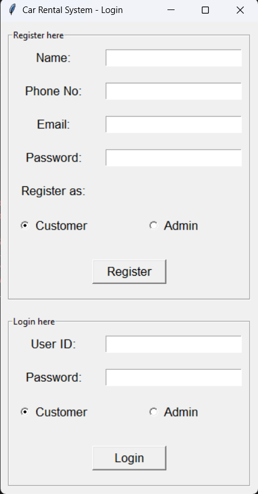
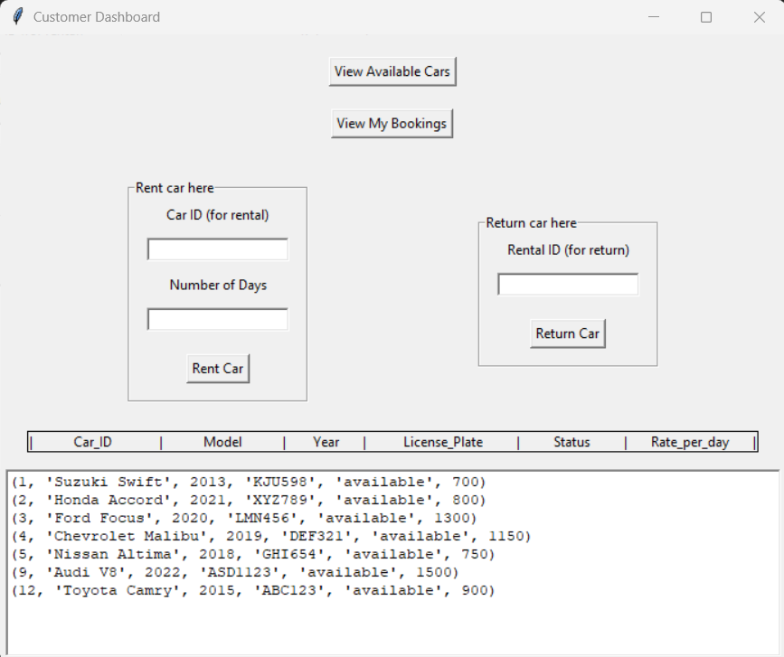
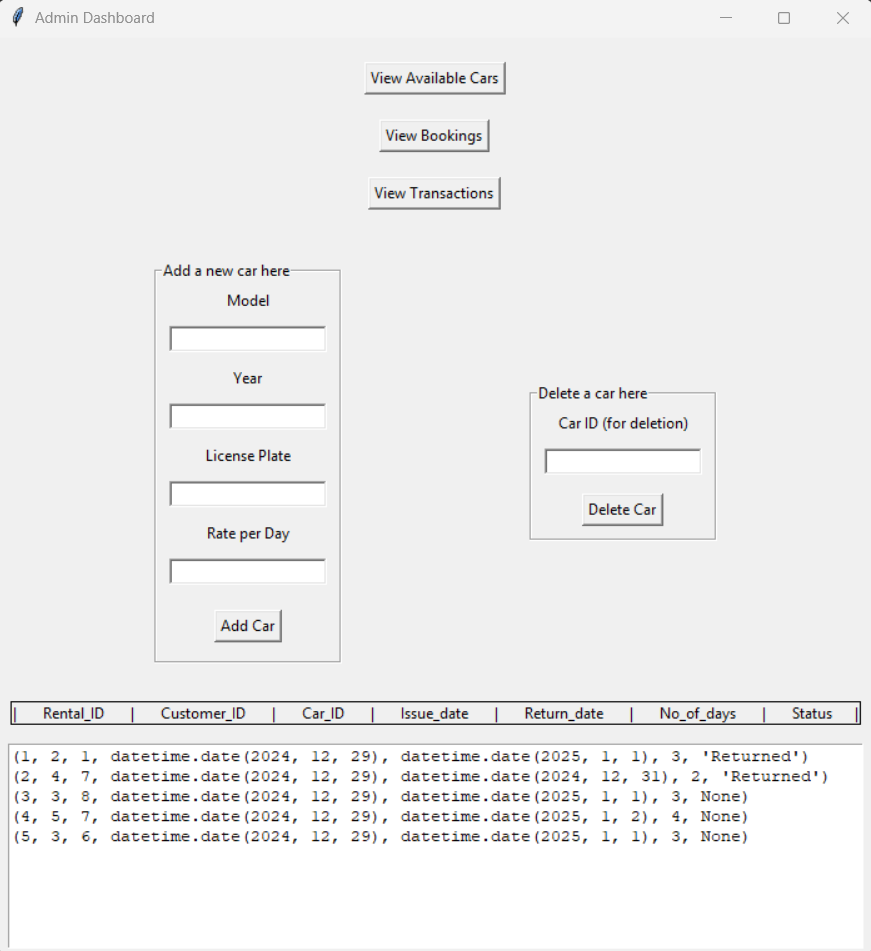

 # Car Rental Management System

## Table of Contents
- [Introduction](#introduction)
- [Features](#features)
- [Technologies Used](#technologies-used)
- [Setup Instructions](#setup-instructions)
- [Usage](#usage)
- [Database Schema](#database-schema)
- [Screenshots](#screenshots)
- [Contributing](#contributing)
- [Contact](#contact)

## Introduction
The Car Rental Management System is a comprehensive application designed to streamline the process of renting and managing cars. It allows customers to view available cars, book rentals, and return cars, while administrators can manage car inventory and rental records. This project is built using Python and MySQL, with a graphical user interface (GUI) created using Tkinter.

## Features
- **Customer Dashboard:** View available cars, book rentals, and return cars.
- **Admin Dashboard:** Manage car inventory, view rental records, and update car status.
- **User Authentication:** Differentiate between customers and administrators.
- **Database Integration:** Persistent data storage using MySQL.
- **Input Validation:** Ensures data integrity and consistency.

## Technologies Used
- **Python:** The primary programming language used.
- **Tkinter:** For creating the graphical user interface.
- **MySQL:** For database management and data storage.
- **mysql-connector-python:** For connecting Python to MySQL.

## Setup Instructions
1. **Clone the repository:**
   Type following commands in your terminal after you have directed in a particular directory.
   
   - git clone https://github.com/amaanshaikh2114/car_rental_management_system.git
   
   - cd car_rental_management_system
    

2. **Install required Python packages:**
    
    pip install mysql-connector-python
    

3. **Set up the MySQL database:**
    - Create a database named `car_rental`.
    - Import the SQL script provided in the `database` folder to create the necessary tables.

4. **Configure database connection:**
    - Update the `connect_to_db()` function in the `db.py` file with your MySQL database credentials.

## Usage
1. **Run the application:**
    
    Type 'python app.py' in your terminal after redirecting to the directory in which the project has been cloned.
    

2. **Customer Dashboard:**
    - **View Available Cars:** Lists all cars available for rent.
    - **View My Bookings:** Shows the current and past bookings of the customer.
    - **Rent Car:** Allows the customer to rent a car by specifying the car ID and number of days.
    - **Return Car:** Enables the customer to return a rented car by providing the rental ID.

3. **Admin Dashboard:**
    - **Add Car:** Adds a new car to the inventory.
    - **Delete Car:** Deletes a car to the inventory.
    - **View all transactions:** Can see all the transactions and payments associated with rentals.
    - **View All Rentals/Bookings:** Displays all rental records containing car, customer, dates etc.

## Database Schema
The database schema includes the following tables:
- **Customer:** Stores customer information (Customer_ID, Name, Phone, Email, Password, Is_Admin).
- **Car:** Stores car details (Car_ID, Model, Year, License_Plate, Status, Rate_per_day).
- **Rental:** Records rental transactions (Rental_ID, Customer_ID, Car_ID, Issue_date, Return_date, No_of_days, Status).
- **Payment**: Consists of payments made for different rentals (Payment_ID, Rental_ID,Payment_Date, Amount)

## Screenshots

## Contributing
Contributions are welcome! If you have any ideas, suggestions, or bug reports, please open an issue or submit a pull request.

## Contact
For any questions or inquiries, please contact [Amaan Shaikh](mailto:amaanmazhar211@gmail.com). Send a mail to amaanmazhar211@gmail.com
